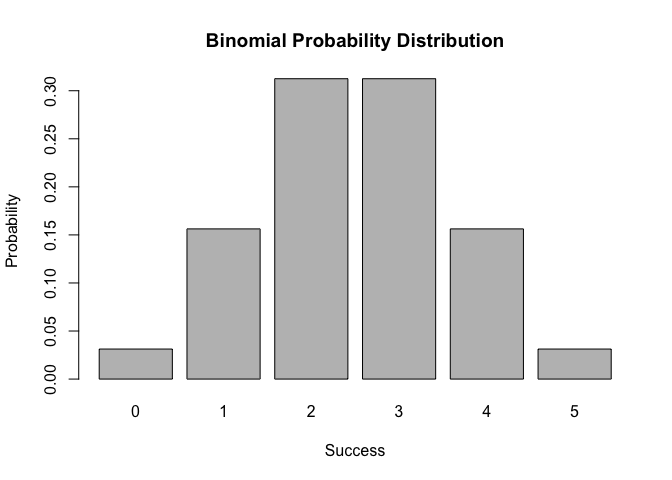
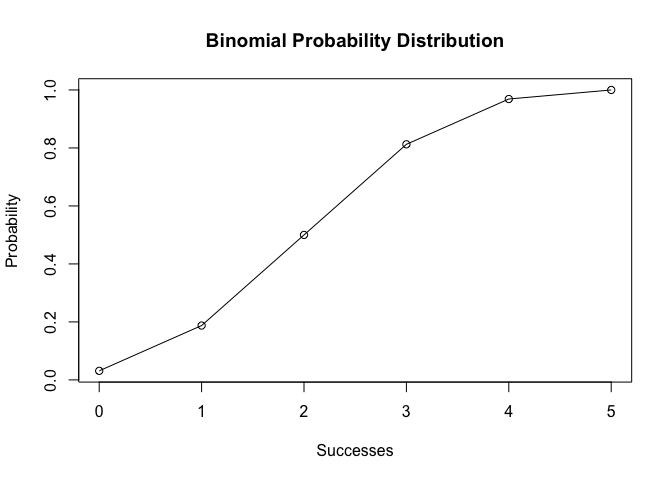

<!-- README.md is generated from README.Rmd. Please edit that file -->
Overview
--------

`"Binomial"` is a [R](http://www.r-project.org/) package that provides functions for calculating probabilities of a Binomial random variable, and related calculations such as the probability distribution, the expected value, variance, etc.

-   `bin_choose()` calculates the number of combinations in which k successes can occur in n trials.
-   `bin_probability()` calculates probabilities about the number of successes in a fixed number of random trials performed under identical conditions
-   `bin_distribution()` calculates probabilities about different number of successes in a fixed number of random trials performed under identical conditions
-   `plot()` method that graphs a barplot to display the probability histogram of a binomial distribution object "bindis".
-   `bin_cumulative()` calculates the cumulative probability of successes
-   `plot()` graphs the cumulative distribution of object "bincum"
-   `bin_variable()` takes in trials and prob and returns a list with trials: number of trials and prob: probability of success.
-   `print()` nicely print the content of an object "binvar"
-   `summary()` a list of class "summary.binvar" containing named elements (trials,prob,mean,variance,mode,skewness,kurtosis) of an object "binvar"
-   `print()` nicely print the content of an object "summary.binvar"

Motivation
----------

This package has been developed to conveniently calculate probabilities of a Binomial random variable, and related calculations such as the probability distribution, the expected value, variance, etc.

Installation
------------

Install the development version from GitHub via the package `"devtools"`:

``` r
# development version from GitHub:
#install.packages("devtools") 

# install "cointoss" (without vignettes)
#devtools::install_github("stat133-sp19/hw-stat133-JingtongZhao/Binomial")
# install "cointoss" (with vignettes)
#devtools::install_github("stat133-sp19/hw-stat133-JingtongZhao/Binomial", build_vignettes = TRUE)
```

Usage
-----

``` r
library(Binomial)
## Calculating combinations
combination = bin_choose(n = 5, k = 2)
combination
#> [1] 10

## Calculating probability
probability = bin_probability(success = 2, trials = 5, prob = 0.5)
probability
#> [1] 0.3125

## Probability distribution
distribution = bin_distribution(trials = 5, prob = 0.5)
distribution
#>   success probability
#> 1       0     0.03125
#> 2       1     0.15625
#> 3       2     0.31250
#> 4       3     0.31250
#> 5       4     0.15625
#> 6       5     0.03125

## Plot of probability distribution
plot(distribution)
```



``` r


## Cumulative probability distribution
cumulative = bin_cumulative(trials = 5, prob = 0.5)
cumulative
#>   success probability cumulative
#> 1       0     0.03125    0.03125
#> 2       1     0.15625    0.18750
#> 3       2     0.31250    0.50000
#> 4       3     0.31250    0.81250
#> 5       4     0.15625    0.96875
#> 6       5     0.03125    1.00000

## Plot of probability distribution
plot(cumulative)
```



``` r

## Binomial Variable
bin1 <- bin_variable(trials = 10, p = 0.3)
summary(bin1)
#> "Summary variable" 
#> 
#> Parameters 
#> - number of trials: 10 
#> - prob of success: 0.3 
#> 
#> Measures 
#> - mean: 3 
#> - variance: 2.1 
#> - mode: 3 
#> - skewness: 0.2760262 
#> - kurtosis: -0.1238095

## Functions of measures
bin_mean(10, 0.3)
#> [1] 3
bin_variance(10, 0.3)
#> [1] 2.1
bin_mode(10, 0.3)
#> [1] 3
bin_skewness(10, 0.3)
#> [1] 0.2760262
bin_kurtosis(10, 0.3)
#> [1] -0.1238095
```
