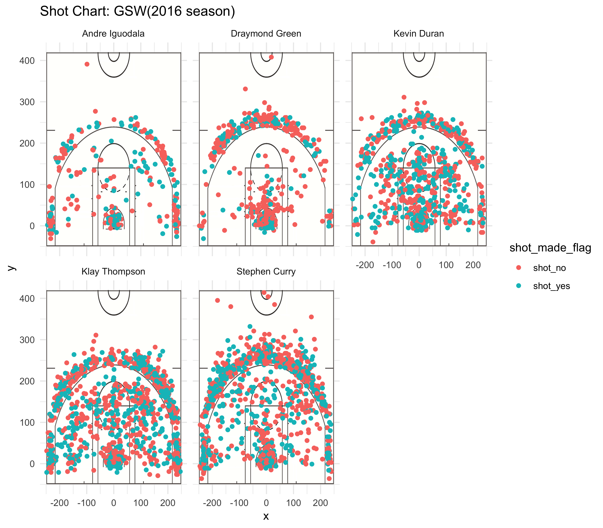

```{r}
library(dplyr)
bind = read.csv("../data/shots-data.csv", stringsAsFactors = FALSE)
PT2 = bind[bind$shot_type=='2PT Field Goal',]
PT2_table = arrange(summarise(
  group_by(PT2, name),
  total = n(),
  made = sum(shot_made_flag=='shot_yes'),
  percentage = made/total),
  desc(percentage))
PT2_table = mutate(PT2_table,expected_point = percentage*2)

PT3 = bind[bind$shot_type=='3PT Field Goal',]
PT3_table = arrange(summarise(
  group_by(PT3, name),
  total = n(),
  made = sum(shot_made_flag=='shot_yes'),
  percentage = made/total),
  desc(percentage))
PT3_table = mutate(PT3_table,expected_point = percentage*3)


total_table = arrange(summarise(
  group_by(bind, name),
  total = n(),
  made = sum(shot_made_flag=='shot_yes'),
  percentage = made/total),

  desc(percentage))

```

##5.2) Narrative

## Report

### Introduction 

After losing the championship in 2015, Golden State Warriors successfully made the revenge and beat Cleveland Cavaliers in the final with 4:1 in Season 2016. In that season, they had a 67-15 wining rate, and crushed their opponents with 4-0s in Western Conference Finals, Semifinals and First Round[1].In the same season, Klay Thompson got 60 points in only 29-minites without even playing the fourth quarter of the game. Curry said, “That’s a feat that I would put money on to probably never be touched again in the history of basketball.” [2]

Many factors altogether determined the excellent performance of Golden State Warriors in Season 2016.This article focuses on analyzing shots made by Golden State Warriors’ five amazing shooters, Andre Iguodala, Draymond Green, Kevin Duran, Klay Thompson, and Stephen Curry in Season 2016, among which both Stephen Curry and Kevin Durant got an average of more than 25 points per game [1].


### Data 
From the original text files [3], shot positions, shot effectiveness and shot types of the players, Andre Iguodala, Draymond Green, Kevin Duran, Klay Thompson, and Stephen Curry, are extracted for the purpose of this article. One shot chart and three effective shot tables are made to better visualize the shot data.
```{r out.width = '80%', echo = FALSE, fig.align='center'}

```
*Figure 1*
This figure shows the shots of the five selected players in GSW. The dots represent the position of the shot in court, with red dots indicating missed shots, and green dots indicating made shots.

```{r out.width = '80%', echo = FALSE, fig.align='center'}
bind = read.csv("../data/shots-data.csv", stringsAsFactors = FALSE)
PT2 = bind[bind$shot_type=='2PT Field Goal',]
PT2_table = arrange(summarise(
  group_by(PT2, name),
  total = n(),
  made = sum(shot_made_flag=='shot_yes'),
  percentage = made/total),
  desc(percentage))
PT2_table = mutate(PT2_table,expected_point = percentage*2)
PT2_table
```

Table 1.1 2PT Effective Shooting % by Player
```{r out.width = '80%', echo = FALSE, fig.align='center'}
PT3 = bind[bind$shot_type=='3PT Field Goal',]
PT3_table = arrange(summarise(
  group_by(PT2, name),
  total = n(),
  made = sum(shot_made_flag=='shot_yes'),
  percentage = made/total),
  desc(percentage))
PT3_table = mutate(PT3_table,expected_point = percentage*3)
PT3_table
```
Table 1.2 3PT Effective Shooting % by Player

```{r  echo = FALSE}
total_table = arrange(summarise(
  group_by(bind, name),
  total = n(),
  made = sum(shot_made_flag=='shot_yes'),
  percentage = made/total),

  desc(percentage))
total_table
```
Table 1.3 Overall (including 2PT and 3PT Field Goals) Effective Shooting % by Player

###Discussion
From the figure and three tables made in the last section, shooting behavior of each player, including shooting pattern and shooting effectiveness are analyzed.

**Andre Iguodala**

By just looking at the dot density of figure 1, we can see that Andre Iguodala made the least number of shots among the five players. There is a cluster of shots in the restricted area, and the furthest attempt made was near the midcourt line. He made a total of 371 shots, among which 210 are 2-point shots. With the 63.81% of effective 2 point shots, he ranked as the highest for 2-point effective shooting.  He was also the second most effective shooter for overall shootings. The average point he got from 2 point shot attempt was 1.28 points, and 1.08 for 3 point shot attempt.


**Draymond Green**

The 2-point shots made by Draymond Green is clustered inside three-second area, and his 3 point shots happened more between the wings. He made two shot attempts near the midcourt.  Draymond Green made 578 shots in total, and his effective percentage for both 2 point shots and 3 point shots were the lowest among the five, being 49.42% and 31.90%, respectively. The lower effective shooting percentage is also displayed in figure 1, with red as the dominant color. The average point he got from 2-point shot attempt is 0.988 points, and 0.957 for 3 point shot attempt.

**Kevin Duran**

The scatter of 2-point attempt shots by Kevin Duran is relatively even. He attempted 2-point shot both in and out of the painted area, and he made 3-point attempt both near the wings and at the corners. Kevin Duran made 915 shots in total. The 60.65% shooting effectiveness brings him as the second most effective 2-point shooter. His 3 point shooting effectiveness was 38.60%. He had the highest effective shooting percentage for overall shooting, which is 51.75%. The average point he got from 2-point shot attempt is 1.21 points, and 1.16 for 3 point shot attempt. 


**Klay Thompson**

With a total of 1220 attempted shots, the dot density for Klay Thompson is crowded. The dot density pattern is similar to Kevin Duran’s, but with a higher percentage located outside of the three-point line. With 580 3-pointer attempts and 41.41% 3 pointer shooting effectiveness, Klay Thompson is the most effective 3-point shooter among the five players. With the effectiveness percentage being 51.41%, his 2-point shooting effectiveness is not as outstanding as his 3-point success. For every 3-point shot attempted, Klay Thompson gets an average of 1.27 points; for every 2-point shot attempted, he gets an average of 1.03 points.

**Stephen Curry**

By looking at Figure one, we can see that Stephen Curry makes the most amount of 3-pointer attempts among the five players. He made five long-distance attempts, which are all located near the mid court line. He made 1250 attempts in total, and 687 of them are 3-pointer shots. With the high number of 3-point shots, Curry had a 40.75% 3-point effective shooting percentage, and he’s the second most effective 3-point shooter. He made 563 2-pointer shots, and the effectiveness is 54.00%. For every 3-point shot attempted, Stephen Curry gets an average of 1.22 points; for every 2-point shot attempted, he gets an average of 1.08 points.


###Conclusions
Among the five players, Andre Iguodala is the most effective 2-point shooter, and Klay Thompson is the most effective 3-point shooter. Although the percentage of effective shooting is much lower for 3-pointers (31.89% to 42.41%) compared with 2-pointers (49.42% to 63.80%), the average point obtained from each shot attempt is similar, which is 0.957 to 1.27 point/attempt for 3 point attempts, and 0.988 to 1.28 point/attempt for 2 point attempts. The success of Golden State Warriors was not determined by any single player, but was determined by the overall good performance on both 2-point and 3-point shot effectiveness.


###References

![1] https://basketball-reference.com/teams/GSW/2017.html

![2] https://bleacherreport.com/articles/2715079-top-moments-from-golden-state-warriors-2016-17-championship-season#slide7

![3] http://github.com/ucb-stat133/stat133-hws

